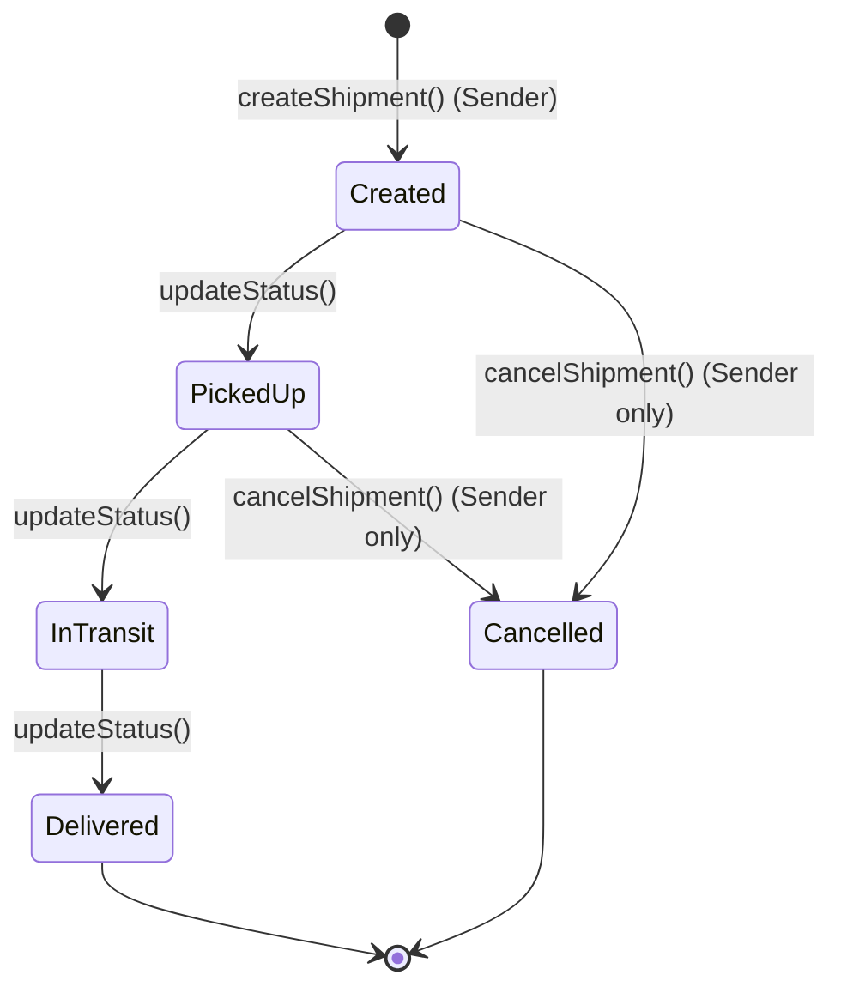
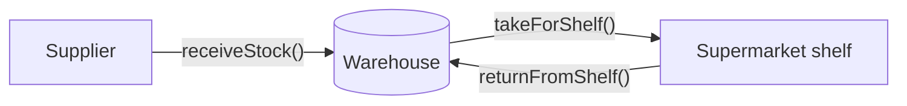
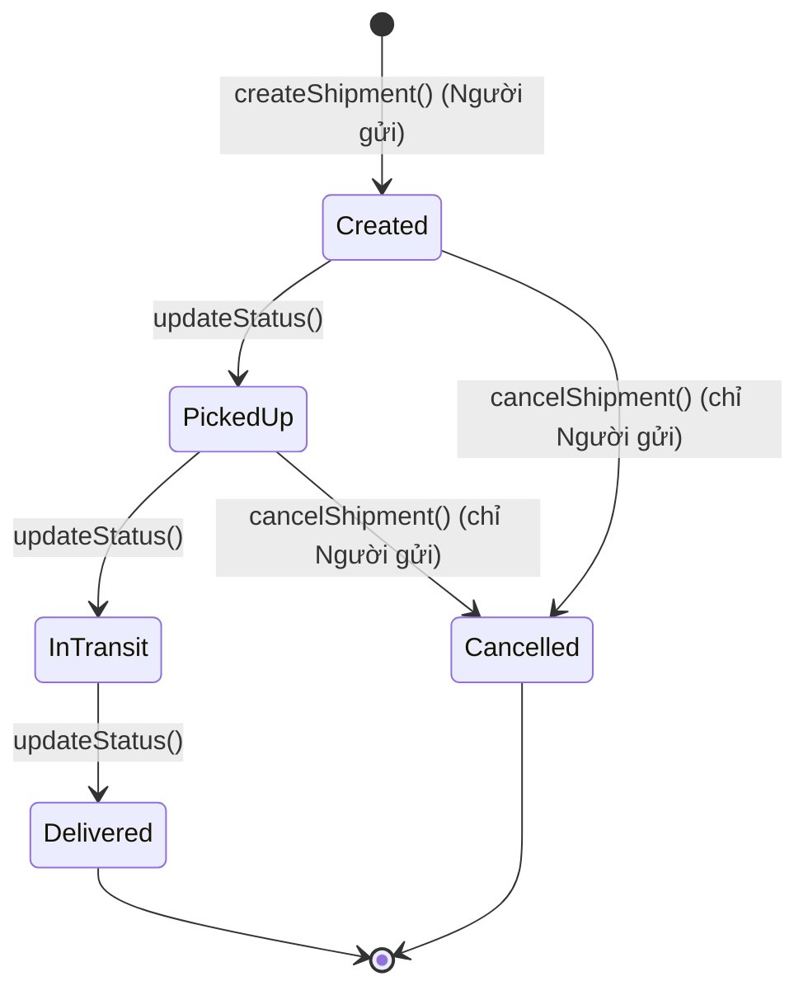
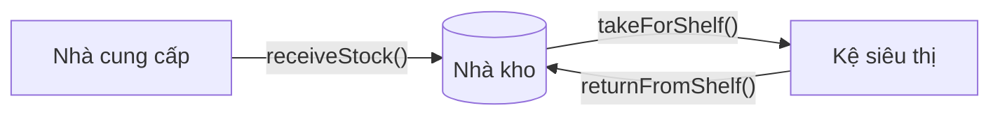

# Logistics Smart Contracts

[English](#english) · [Tiếng Việt](#tiếng-việt)

---

## English

Solidity smart contracts that demonstrate shipment tracking (logistics) and central warehouse stock management on the blockchain.

### Project structure

```
contracts/
├── interfaces/
│   ├── ILogisticsTracking.sol   # Interface: enums, structs, events, function signatures
│   └── IWarehouse.sol           # Interface: enums, structs, events, function signatures
├── LogisticsTracking.sol        # Shipment lifecycle tracking (implements ILogisticsTracking)
└── Warehouse.sol                # Warehouse stock management (implements IWarehouse)
diagrams/
└── logistics-flow.workflow.json # Archify workflow diagram spec
```

Each contract implements its own interface. Other contracts (for example a supermarket or a carrier dApp) can call them through the interface with only the deployed address:

```solidity
IWarehouse warehouse = IWarehouse(warehouseAddress);
warehouse.takeForShelf(productId, 10);
```

### Flow 1: Shipment lifecycle (`LogisticsTracking.sol`)



1. **Create.** The sender calls `createShipment(carrier, receiver, description, origin, destination)`. The contract assigns a new ID, sets the status to `Created`, records the first history entry, and emits `ShipmentCreated`.
2. **Update the status.** A participant in the shipment (sender, carrier or receiver) calls `updateStatus(id, newStatus, location, note)` as the goods move: `PickedUp` → `InTransit` → `Delivered`. Each call adds a `StatusUpdate` entry (status, location, note, timestamp, caller) and emits `StatusUpdated`.
3. **Deliver.** When the status becomes `Delivered`, the contract stores `deliveredAt` and emits `ShipmentDelivered`. After that, the shipment can no longer be updated.
4. **Cancel (exception).** Only the sender can call `cancelShipment(id, reason)`, and only while the shipment is `Created` or `PickedUp`. The status becomes `Cancelled`, the reason is saved in the history, and `ShipmentCancelled` is emitted. A cancelled shipment can no longer be updated.
5. **Query.** `getShipment(id)`, `getHistory(id)` and `getHistoryCount(id)` return the current state and the full audit trail. dApps can also listen to the events in real time.

**Rules enforced on-chain**
- The carrier and receiver addresses must not be the zero address.
- Only the sender, carrier or receiver of a shipment can update its status.
- A shipment cannot go back to `Created`, and cannot be updated after it is `Delivered` or `Cancelled`.
- The owner (the deployer) can call `setCarrierAuthorization(carrier, bool)` to keep a list of approved carriers (`isAuthorizedCarrier`). This list is not yet checked when a shipment is created.

> Note: `updateStatus` does not enforce the order of the statuses. For example, a participant can move a shipment directly from `Created` to `Delivered`. The diagram shows the intended business flow.

### Flow 2: Warehouse stock (`Warehouse.sol`)



1. **Receive stock.** `receiveStock(productId, amount)` adds goods from a supplier. A new product is created automatically. The status becomes `InStock` and `StockReceived` is emitted.
2. **Take for the shelf.** `takeForShelf(productId, amount)` moves goods from the warehouse to the supermarket shelf. It fails if there is not enough stock. When the quantity reaches 0, the status becomes `OutOfStock`. `TakenForShelf` is emitted.
3. **Return from the shelf.** When a product is discontinued, `returnFromShelf(productId, amount)` puts the goods on the shelf back into the warehouse. The contract increases both `quantity` and `returnedQuantity`, sets the status to `Returned`, and emits `ReturnedToWarehouse`.
4. **Query.** `getWarehouseItem(productId)` returns the full record. `getStock(productId)` returns the current quantity, or 0 if the product does not exist.

| Status | Meaning |
|---|---|
| `InStock` | The warehouse has stock |
| `OutOfStock` | The quantity is 0 after taking goods for the shelf |
| `Returned` | The latest movement was a return from the shelf |

> Note: the `Warehouse` functions have no access control yet, so any address can call them.

### Getting started

1. Open the project in [Remix IDE](https://remix.ethereum.org), or use Hardhat or Foundry.
2. Compile with Solidity **0.8.24** (`LogisticsTracking` requires `^0.8.24`; `Warehouse` accepts `^0.8.0`).
3. Deploy to a local node or a testnet such as Sepolia.

### Diagram

`diagrams/logistics-flow.workflow.json` is the Archify spec of the shipment workflow. Render it with Archify to get an interactive HTML diagram.

---

## Tiếng Việt

Bộ smart contract Solidity minh họa việc theo dõi lô hàng (logistics) và quản lý tồn kho trung tâm (warehouse) trên blockchain.

### Cấu trúc dự án

```
contracts/
├── interfaces/
│   ├── ILogisticsTracking.sol   # Interface: enum, struct, event, chữ ký hàm
│   └── IWarehouse.sol           # Interface: enum, struct, event, chữ ký hàm
├── LogisticsTracking.sol        # Theo dõi vòng đời lô hàng (kế thừa ILogisticsTracking)
└── Warehouse.sol                # Quản lý tồn kho (kế thừa IWarehouse)
diagrams/
└── logistics-flow.workflow.json # Đặc tả sơ đồ workflow Archify
```

Mỗi contract kế thừa interface riêng của nó. Contract khác (ví dụ siêu thị hoặc dApp của đơn vị vận chuyển) có thể gọi qua interface, chỉ cần địa chỉ đã deploy:

```solidity
IWarehouse warehouse = IWarehouse(warehouseAddress);
warehouse.takeForShelf(productId, 10);
```

### Flow 1: Vòng đời lô hàng (`LogisticsTracking.sol`)



1. **Tạo đơn.** Người gửi gọi `createShipment(carrier, receiver, description, origin, destination)`. Contract cấp ID mới, đặt trạng thái `Created`, ghi dòng lịch sử đầu tiên và phát event `ShipmentCreated`.
2. **Cập nhật trạng thái.** Người tham gia đơn hàng (người gửi, đơn vị vận chuyển hoặc người nhận) gọi `updateStatus(id, newStatus, location, note)` khi hàng di chuyển: `PickedUp` → `InTransit` → `Delivered`. Mỗi lần gọi thêm một bản ghi `StatusUpdate` (trạng thái, vị trí, ghi chú, thời gian, người cập nhật) và phát event `StatusUpdated`.
3. **Giao hàng.** Khi trạng thái chuyển sang `Delivered`, contract lưu `deliveredAt` và phát event `ShipmentDelivered`. Từ đó đơn hàng không thể cập nhật thêm.
4. **Hủy đơn (ngoại lệ).** Chỉ người gửi được gọi `cancelShipment(id, reason)`, và chỉ khi đơn đang ở `Created` hoặc `PickedUp`. Trạng thái chuyển sang `Cancelled`, lý do được lưu vào lịch sử và phát event `ShipmentCancelled`. Đơn đã hủy không thể cập nhật thêm.
5. **Tra cứu.** `getShipment(id)`, `getHistory(id)` và `getHistoryCount(id)` trả về trạng thái hiện tại và toàn bộ lịch sử. dApp cũng có thể lắng nghe event theo thời gian thực.

**Các quy tắc kiểm tra on-chain**
- Địa chỉ đơn vị vận chuyển và người nhận không được là địa chỉ 0.
- Chỉ người gửi, đơn vị vận chuyển hoặc người nhận của đơn hàng mới được cập nhật trạng thái.
- Không thể quay lại `Created`, và không thể cập nhật khi đơn đã `Delivered` hoặc `Cancelled`.
- Owner (người deploy) có thể gọi `setCarrierAuthorization(carrier, bool)` để quản lý danh sách đơn vị vận chuyển được duyệt (`isAuthorizedCarrier`). Danh sách này hiện chưa được kiểm tra khi tạo đơn.

> Lưu ý: `updateStatus` không bắt buộc thứ tự trạng thái. Ví dụ, người tham gia có thể chuyển thẳng từ `Created` sang `Delivered`. Sơ đồ thể hiện luồng nghiệp vụ mong muốn.

### Flow 2: Tồn kho (`Warehouse.sol`)



1. **Nhập hàng.** `receiveStock(productId, amount)` nhận hàng từ nhà cung cấp. Sản phẩm mới được tự động tạo. Trạng thái chuyển sang `InStock` và phát event `StockReceived`.
2. **Lấy hàng lên kệ.** `takeForShelf(productId, amount)` chuyển hàng từ kho lên kệ siêu thị. Giao dịch thất bại nếu kho không đủ hàng. Khi số lượng về 0, trạng thái chuyển sang `OutOfStock`. Phát event `TakenForShelf`.
3. **Trả hàng về kho.** Khi ngừng kinh doanh sản phẩm, `returnFromShelf(productId, amount)` đưa hàng còn trên kệ về kho. Contract tăng cả `quantity` và `returnedQuantity`, đặt trạng thái `Returned` và phát event `ReturnedToWarehouse`.
4. **Tra cứu.** `getWarehouseItem(productId)` trả về toàn bộ thông tin. `getStock(productId)` trả về số lượng hiện tại, hoặc 0 nếu sản phẩm chưa tồn tại.

| Trạng thái | Ý nghĩa |
|---|---|
| `InStock` | Kho còn hàng |
| `OutOfStock` | Số lượng bằng 0 sau khi lấy hàng lên kệ |
| `Returned` | Lần thay đổi gần nhất là hàng trả về từ kệ |

> Lưu ý: các hàm của `Warehouse` chưa có kiểm soát quyền, nên địa chỉ nào cũng gọi được.

### Chạy thử

1. Mở dự án trong [Remix IDE](https://remix.ethereum.org), hoặc dùng Hardhat hay Foundry.
2. Biên dịch với Solidity **0.8.24** (`LogisticsTracking` yêu cầu `^0.8.24`; `Warehouse` chấp nhận `^0.8.0`).
3. Deploy lên local node hoặc mạng test như Sepolia.

### Sơ đồ

`diagrams/logistics-flow.workflow.json` là đặc tả Archify của workflow lô hàng. Render bằng Archify để có sơ đồ HTML tương tác.

---

## License

MIT
