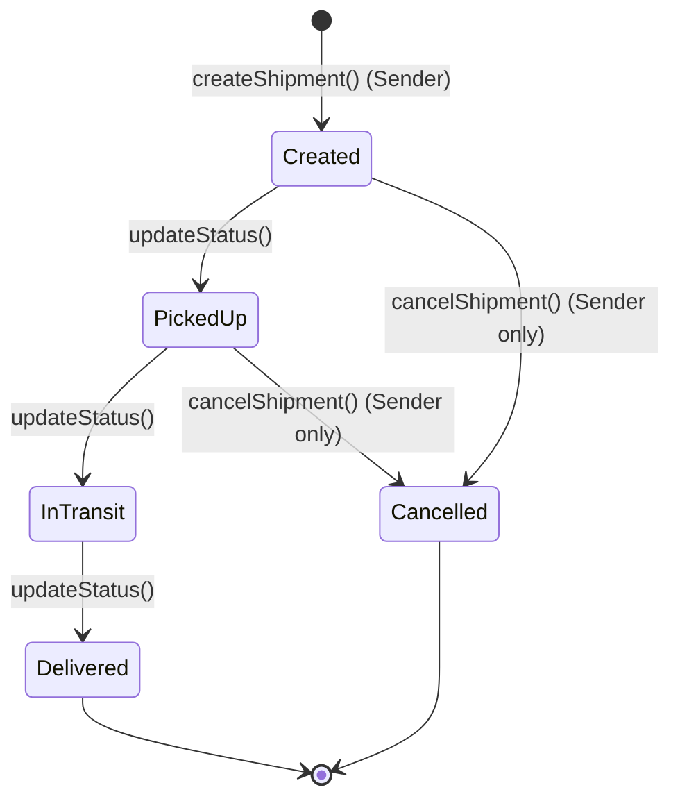
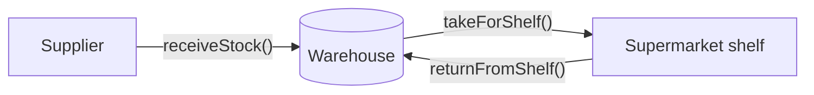
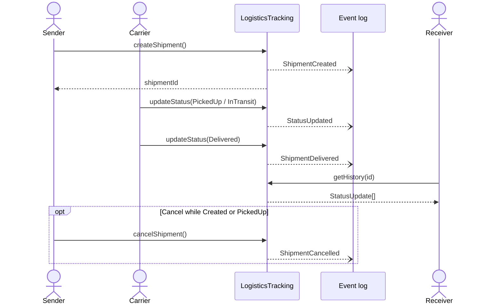
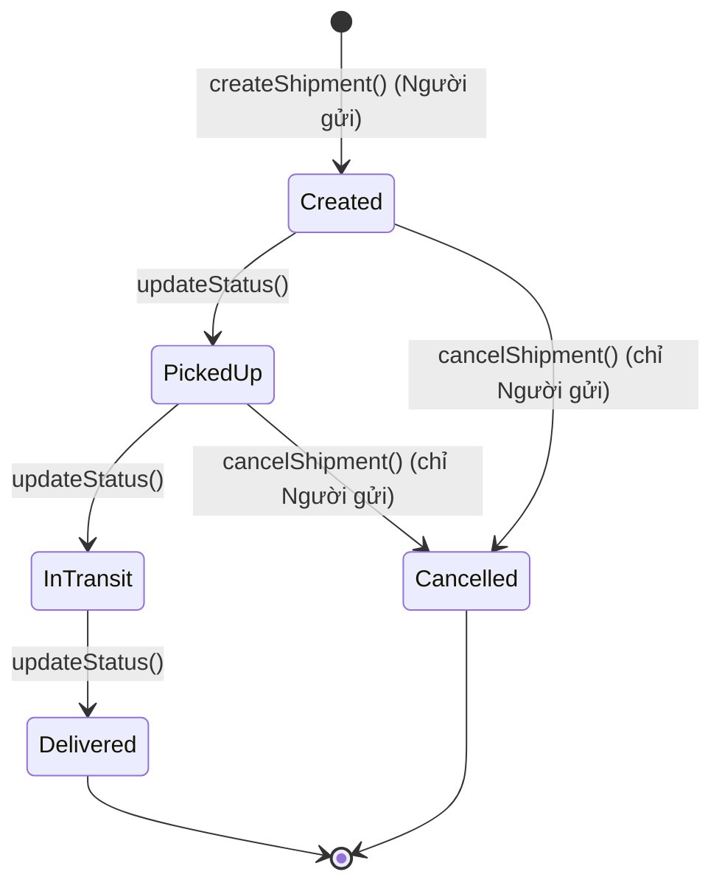
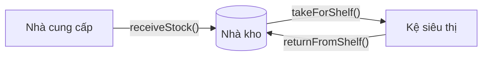
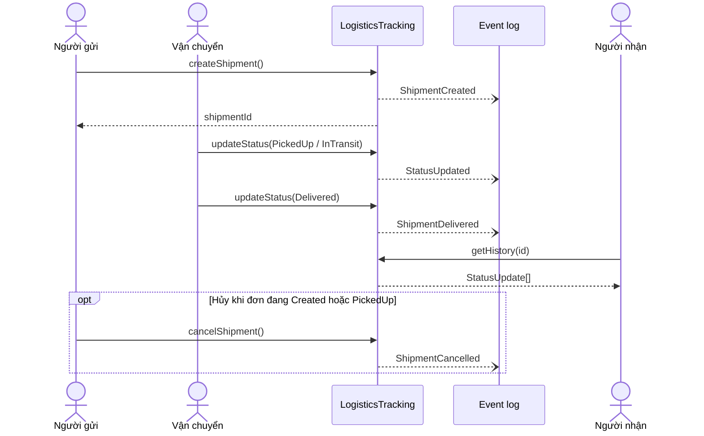

# Logistics Smart Contracts

[English](#english) · [Tiếng Việt](#tiếng-việt)

---

## English

Solidity smart contracts that demonstrate shipment tracking (logistics) and central warehouse stock management on the blockchain.

### Project structure

```
contracts/
├── interfaces/
│   ├── ILogisticsTracking.sol   # Interface: enums, structs, events, function signatures
│   └── IWarehouse.sol           # Interface: enums, structs, events, function signatures
├── LogisticsTracking.sol        # Shipment lifecycle tracking (implements ILogisticsTracking)
└── Warehouse.sol                # Warehouse stock management (implements IWarehouse)
diagrams/
├── logistics-flow.workflow.json       # Archify workflow diagram spec
├── logistics-shipment.sequence.json   # Archify sequence diagram spec
└── logistics-shipment-sequence.html   # Rendered interactive sequence diagram
```

Each contract implements its own interface. Other contracts (for example a supermarket or a carrier dApp) can call them through the interface with only the deployed address:

```solidity
IWarehouse warehouse = IWarehouse(warehouseAddress);
warehouse.takeForShelf(productId, 10);
```

### Flow 1: Shipment lifecycle (`LogisticsTracking.sol`)



1. **Create.** The sender calls `createShipment(carrier, receiver, description, origin, destination)`. The contract assigns a new ID, sets the status to `Created`, records the first history entry, and emits `ShipmentCreated`.
2. **Update the status.** A participant in the shipment (sender, carrier or receiver) calls `updateStatus(id, newStatus, location, note)` as the goods move: `PickedUp` → `InTransit` → `Delivered`. Each call adds a `StatusUpdate` entry (status, location, note, timestamp, caller) and emits `StatusUpdated`.
3. **Deliver.** When the status becomes `Delivered`, the contract stores `deliveredAt` and emits `ShipmentDelivered`. After that, the shipment can no longer be updated.
4. **Cancel (exception).** Only the sender can call `cancelShipment(id, reason)`, and only while the shipment is `Created` or `PickedUp`. The status becomes `Cancelled`, the reason is saved in the history, and `ShipmentCancelled` is emitted. A cancelled shipment can no longer be updated.
5. **Query.** `getShipment(id)`, `getHistory(id)` and `getHistoryCount(id)` return the current state and the full audit trail. dApps can also listen to the events in real time.

**Rules enforced on-chain**
- The carrier and receiver addresses must not be the zero address.
- Only the sender, carrier or receiver of a shipment can update its status.
- A shipment cannot go back to `Created`, and cannot be updated after it is `Delivered` or `Cancelled`.
- The owner (the deployer) can call `setCarrierAuthorization(carrier, bool)` to keep a list of approved carriers (`isAuthorizedCarrier`). This list is not yet checked when a shipment is created.

> Note: `updateStatus` does not enforce the order of the statuses. For example, a participant can move a shipment directly from `Created` to `Delivered`. The diagram shows the intended business flow.

### Flow 2: Warehouse stock (`Warehouse.sol`)



1. **Receive stock.** `receiveStock(productId, amount)` adds goods from a supplier. A new product is created automatically. The status becomes `InStock` and `StockReceived` is emitted.
2. **Take for the shelf.** `takeForShelf(productId, amount)` moves goods from the warehouse to the supermarket shelf. It fails if there is not enough stock. When the quantity reaches 0, the status becomes `OutOfStock`. `TakenForShelf` is emitted.
3. **Return from the shelf.** When a product is discontinued, `returnFromShelf(productId, amount)` puts the goods on the shelf back into the warehouse. The contract increases both `quantity` and `returnedQuantity`, sets the status to `Returned`, and emits `ReturnedToWarehouse`.
4. **Query.** `getWarehouseItem(productId)` returns the full record. `getStock(productId)` returns the current quantity, or 0 if the product does not exist.

| Status | Meaning |
|---|---|
| `InStock` | The warehouse has stock |
| `OutOfStock` | The quantity is 0 after taking goods for the shelf |
| `Returned` | The latest movement was a return from the shelf |

> Note: the `Warehouse` functions have no access control yet, so any address can call them.

### Getting started

#### Compile

1. Open the project in [Remix IDE](https://remix.ethereum.org). To work on the local folder, run this in the project root and choose **Workspaces → Connect to Localhost** in Remix:
   ```bash
   npx @remix-project/remixd -s . -u https://remix.ethereum.org
   ```
2. In the **Solidity Compiler** tab, select compiler **0.8.24** (`LogisticsTracking` requires `^0.8.24`; `Warehouse` accepts `^0.8.0`).
3. Open `contracts/LogisticsTracking.sol` and `contracts/Warehouse.sol` and click **Compile** for each. The imported interfaces are compiled automatically.

To compile from the command line instead (run inside `contracts/`):

```bash
npx --yes solc@0.8.24 --bin --abi --base-path . -o build LogisticsTracking.sol Warehouse.sol
```

#### Deploy

1. In the **Deploy & Run Transactions** tab, set **Environment** to **Remix VM (Cancun)**. It provides 10 test accounts with 100 fake ETH each.
2. In **Contract**, select `LogisticsTracking` or `Warehouse`. Interfaces (`I...`) cannot be deployed.
3. Click **Deploy**. The contract appears under **Deployed Contracts**.

To deploy to the Sepolia testnet, get Sepolia ETH from a faucet, set **Environment** to **Injected Provider – MetaMask**, and confirm the transaction in MetaMask.

### Test scenarios

#### LogisticsTracking

Use three Remix VM accounts: **Account 1 = Sender** (deployer), **Account 2 = Carrier**, **Account 3 = Receiver**. Switch accounts in the **Account** field before each call.

`Status` values are passed as numbers: `0` = Created, `1` = PickedUp, `2` = InTransit, `3` = Delivered, `4` = Cancelled.

**Happy path**

| # | Account | Function | Arguments | Expected result |
|---|---|---|---|---|
| 1 | Sender | `createShipment` | `<Carrier>, <Receiver>, "Laptop", "Ha Noi", "HCM"` | Shipment ID 1 is created, `ShipmentCreated` is emitted |
| 2 | Carrier | `updateStatus` | `1, 1, "Ha Noi warehouse", "Picked up"` | Status is `PickedUp` |
| 3 | Carrier | `updateStatus` | `1, 2, "Da Nang", "In transit"` | Status is `InTransit` |
| 4 | Carrier | `updateStatus` | `1, 3, "HCM", "Delivered"` | Status is `Delivered`, `deliveredAt` is set, `ShipmentDelivered` is emitted |
| 5 | Any | `getShipment` / `getHistory` | `1` | Status `3`, 4 history entries |

**Cancellation**

| # | Account | Function | Arguments | Expected result |
|---|---|---|---|---|
| 1 | Sender | `createShipment` | `<Carrier>, <Receiver>, "Phone", "Ha Noi", "Hue"` | Shipment ID 2 is created |
| 2 | Sender | `cancelShipment` | `2, "Customer changed order"` | Status is `Cancelled`, `ShipmentCancelled` is emitted |
| 3 | Any | `getHistory` | `2` | 2 entries; the last one holds the reason |

**Expected reverts**

| Case | Call | Revert message |
|---|---|---|
| Unrelated account updates a shipment | Account 4: `updateStatus(1, 2, "x", "x")` | `Ban khong lien quan den don hang nay` |
| Update after delivery | Carrier: `updateStatus(1, 2, "x", "x")` on shipment 1 | `Don hang da giao, khong the cap nhat` |
| Update after cancellation | Sender: `updateStatus(2, 1, "x", "x")` on shipment 2 | `Don hang da bi huy` |
| Go back to `Created` | Create shipment 3, then `updateStatus(3, 0, "x", "x")` | `Khong the quay lai trang thai Created` |
| Non-sender cancels | Carrier: `cancelShipment(3, "x")` | `Chi nguoi gui moi duoc huy` |
| Cancel while in transit | Move shipment 3 to `InTransit`, then Sender: `cancelShipment(3, "x")` | `Khong the huy o giai doan nay` |
| Zero address | `createShipment(0x0000000000000000000000000000000000000000, <Receiver>, ...)` | `Dia chi khong hop le` |
| Non-owner authorizes a carrier | Account 2: `setCarrierAuthorization(<Carrier>, true)` | `Chi owner moi duoc goi` |
| Unknown shipment | `getShipment(999)` | `Shipment khong ton tai` |

#### Warehouse

`WarehouseStatus` values: `0` = InStock, `1` = OutOfStock, `2` = Returned.

| # | Function | Arguments | Expected result |
|---|---|---|---|
| 1 | `getStock` | `101` | `0` (product does not exist yet) |
| 2 | `receiveStock` | `101, 50` | `getStock(101)` = 50, status `0` |
| 3 | `takeForShelf` | `101, 20` | Quantity 30, status `0` |
| 4 | `takeForShelf` | `101, 30` | Quantity 0, status `1` |
| 5 | `returnFromShelf` | `101, 5` | Quantity 5, `returnedQuantity` 5, status `2` |
| 6 | `receiveStock` | `101, 10` | Quantity 15, status `0` |

**Expected reverts**

| Call | Revert message |
|---|---|
| `receiveStock(101, 0)` | `Amount must be greater than 0` |
| `takeForShelf(101, 1000)` | `Not enough stock in warehouse` |
| `takeForShelf(999, 1)` | `Warehouse item not found` |
| `getWarehouseItem(999)` | `Warehouse item not found` |
| `returnFromShelf(101, 0)` | `Return amount must be greater than 0` |

### Diagram

#### Sequence diagram

The function-call sequence of `LogisticsTracking`:



For the interactive version (pan/zoom, dark mode, export), download [`diagrams/logistics-shipment-sequence.html`](diagrams/logistics-shipment-sequence.html) and open it in a browser. The source spec is [`diagrams/logistics-shipment.sequence.json`](diagrams/logistics-shipment.sequence.json).

#### Workflow diagram

`diagrams/logistics-flow.workflow.json` is the Archify spec of the shipment workflow. Render it with Archify to get an interactive HTML diagram.

---

## Tiếng Việt

Bộ smart contract Solidity minh họa việc theo dõi lô hàng (logistics) và quản lý tồn kho trung tâm (warehouse) trên blockchain.

### Cấu trúc dự án

```
contracts/
├── interfaces/
│   ├── ILogisticsTracking.sol   # Interface: enum, struct, event, chữ ký hàm
│   └── IWarehouse.sol           # Interface: enum, struct, event, chữ ký hàm
├── LogisticsTracking.sol        # Theo dõi vòng đời lô hàng (kế thừa ILogisticsTracking)
└── Warehouse.sol                # Quản lý tồn kho (kế thừa IWarehouse)
diagrams/
├── logistics-flow.workflow.json       # Đặc tả sơ đồ workflow Archify
├── logistics-shipment.sequence.json   # Đặc tả sơ đồ tuần tự Archify
└── logistics-shipment-sequence.html   # Sơ đồ tuần tự tương tác đã render
```

Mỗi contract kế thừa interface riêng của nó. Contract khác (ví dụ siêu thị hoặc dApp của đơn vị vận chuyển) có thể gọi qua interface, chỉ cần địa chỉ đã deploy:

```solidity
IWarehouse warehouse = IWarehouse(warehouseAddress);
warehouse.takeForShelf(productId, 10);
```

### Flow 1: Vòng đời lô hàng (`LogisticsTracking.sol`)



1. **Tạo đơn.** Người gửi gọi `createShipment(carrier, receiver, description, origin, destination)`. Contract cấp ID mới, đặt trạng thái `Created`, ghi dòng lịch sử đầu tiên và phát event `ShipmentCreated`.
2. **Cập nhật trạng thái.** Người tham gia đơn hàng (người gửi, đơn vị vận chuyển hoặc người nhận) gọi `updateStatus(id, newStatus, location, note)` khi hàng di chuyển: `PickedUp` → `InTransit` → `Delivered`. Mỗi lần gọi thêm một bản ghi `StatusUpdate` (trạng thái, vị trí, ghi chú, thời gian, người cập nhật) và phát event `StatusUpdated`.
3. **Giao hàng.** Khi trạng thái chuyển sang `Delivered`, contract lưu `deliveredAt` và phát event `ShipmentDelivered`. Từ đó đơn hàng không thể cập nhật thêm.
4. **Hủy đơn (ngoại lệ).** Chỉ người gửi được gọi `cancelShipment(id, reason)`, và chỉ khi đơn đang ở `Created` hoặc `PickedUp`. Trạng thái chuyển sang `Cancelled`, lý do được lưu vào lịch sử và phát event `ShipmentCancelled`. Đơn đã hủy không thể cập nhật thêm.
5. **Tra cứu.** `getShipment(id)`, `getHistory(id)` và `getHistoryCount(id)` trả về trạng thái hiện tại và toàn bộ lịch sử. dApp cũng có thể lắng nghe event theo thời gian thực.

**Các quy tắc kiểm tra on-chain**
- Địa chỉ đơn vị vận chuyển và người nhận không được là địa chỉ 0.
- Chỉ người gửi, đơn vị vận chuyển hoặc người nhận của đơn hàng mới được cập nhật trạng thái.
- Không thể quay lại `Created`, và không thể cập nhật khi đơn đã `Delivered` hoặc `Cancelled`.
- Owner (người deploy) có thể gọi `setCarrierAuthorization(carrier, bool)` để quản lý danh sách đơn vị vận chuyển được duyệt (`isAuthorizedCarrier`). Danh sách này hiện chưa được kiểm tra khi tạo đơn.

> Lưu ý: `updateStatus` không bắt buộc thứ tự trạng thái. Ví dụ, người tham gia có thể chuyển thẳng từ `Created` sang `Delivered`. Sơ đồ thể hiện luồng nghiệp vụ mong muốn.

### Flow 2: Tồn kho (`Warehouse.sol`)



1. **Nhập hàng.** `receiveStock(productId, amount)` nhận hàng từ nhà cung cấp. Sản phẩm mới được tự động tạo. Trạng thái chuyển sang `InStock` và phát event `StockReceived`.
2. **Lấy hàng lên kệ.** `takeForShelf(productId, amount)` chuyển hàng từ kho lên kệ siêu thị. Giao dịch thất bại nếu kho không đủ hàng. Khi số lượng về 0, trạng thái chuyển sang `OutOfStock`. Phát event `TakenForShelf`.
3. **Trả hàng về kho.** Khi ngừng kinh doanh sản phẩm, `returnFromShelf(productId, amount)` đưa hàng còn trên kệ về kho. Contract tăng cả `quantity` và `returnedQuantity`, đặt trạng thái `Returned` và phát event `ReturnedToWarehouse`.
4. **Tra cứu.** `getWarehouseItem(productId)` trả về toàn bộ thông tin. `getStock(productId)` trả về số lượng hiện tại, hoặc 0 nếu sản phẩm chưa tồn tại.

| Trạng thái | Ý nghĩa |
|---|---|
| `InStock` | Kho còn hàng |
| `OutOfStock` | Số lượng bằng 0 sau khi lấy hàng lên kệ |
| `Returned` | Lần thay đổi gần nhất là hàng trả về từ kệ |

> Lưu ý: các hàm của `Warehouse` chưa có kiểm soát quyền, nên địa chỉ nào cũng gọi được.

### Chạy thử

#### Compile

1. Mở dự án trong [Remix IDE](https://remix.ethereum.org). Để làm việc trực tiếp với thư mục trên máy, chạy lệnh sau ở thư mục gốc của dự án, rồi trong Remix chọn **Workspaces → Connect to Localhost**:
   ```bash
   npx @remix-project/remixd -s . -u https://remix.ethereum.org
   ```
2. Ở tab **Solidity Compiler**, chọn compiler **0.8.24** (`LogisticsTracking` yêu cầu `^0.8.24`; `Warehouse` chấp nhận `^0.8.0`).
3. Mở `contracts/LogisticsTracking.sol` và `contracts/Warehouse.sol`, bấm **Compile** cho từng file. Các interface được `import` sẽ tự compile theo.

Hoặc compile bằng dòng lệnh (chạy trong thư mục `contracts/`):

```bash
npx --yes solc@0.8.24 --bin --abi --base-path . -o build LogisticsTracking.sol Warehouse.sol
```

#### Deploy

1. Ở tab **Deploy & Run Transactions**, chọn **Environment** là **Remix VM (Cancun)**. Remix cho sẵn 10 tài khoản test, mỗi tài khoản 100 ETH ảo.
2. Ở ô **Contract**, chọn `LogisticsTracking` hoặc `Warehouse`. Interface (`I...`) không deploy được.
3. Bấm **Deploy**. Contract hiện ở mục **Deployed Contracts**.

Để deploy lên testnet Sepolia: lấy ETH Sepolia từ faucet, chọn **Environment** là **Injected Provider – MetaMask**, rồi xác nhận giao dịch trong MetaMask.

### Kịch bản test

#### LogisticsTracking

Dùng 3 tài khoản Remix VM: **Account 1 = Người gửi** (người deploy), **Account 2 = Đơn vị vận chuyển**, **Account 3 = Người nhận**. Đổi tài khoản ở ô **Account** trước mỗi lần gọi hàm.

Giá trị `Status` nhập bằng số: `0` = Created, `1` = PickedUp, `2` = InTransit, `3` = Delivered, `4` = Cancelled.

**Luồng thành công**

| # | Tài khoản | Hàm | Tham số | Kết quả mong đợi |
|---|---|---|---|---|
| 1 | Người gửi | `createShipment` | `<Carrier>, <Receiver>, "Laptop", "Ha Noi", "HCM"` | Tạo đơn ID 1, phát event `ShipmentCreated` |
| 2 | Vận chuyển | `updateStatus` | `1, 1, "Kho Ha Noi", "Da lay hang"` | Trạng thái `PickedUp` |
| 3 | Vận chuyển | `updateStatus` | `1, 2, "Da Nang", "Dang van chuyen"` | Trạng thái `InTransit` |
| 4 | Vận chuyển | `updateStatus` | `1, 3, "HCM", "Da giao"` | Trạng thái `Delivered`, có `deliveredAt`, phát event `ShipmentDelivered` |
| 5 | Bất kỳ | `getShipment` / `getHistory` | `1` | Trạng thái `3`, 4 dòng lịch sử |

**Hủy đơn**

| # | Tài khoản | Hàm | Tham số | Kết quả mong đợi |
|---|---|---|---|---|
| 1 | Người gửi | `createShipment` | `<Carrier>, <Receiver>, "Dien thoai", "Ha Noi", "Hue"` | Tạo đơn ID 2 |
| 2 | Người gửi | `cancelShipment` | `2, "Khach doi don"` | Trạng thái `Cancelled`, phát event `ShipmentCancelled` |
| 3 | Bất kỳ | `getHistory` | `2` | 2 dòng lịch sử, dòng cuối chứa lý do hủy |

**Các trường hợp phải revert**

| Trường hợp | Lệnh gọi | Thông báo lỗi |
|---|---|---|
| Tài khoản không liên quan cập nhật đơn | Account 4: `updateStatus(1, 2, "x", "x")` | `Ban khong lien quan den don hang nay` |
| Cập nhật sau khi đã giao | Vận chuyển: `updateStatus(1, 2, "x", "x")` với đơn 1 | `Don hang da giao, khong the cap nhat` |
| Cập nhật sau khi đã hủy | Người gửi: `updateStatus(2, 1, "x", "x")` với đơn 2 | `Don hang da bi huy` |
| Quay lại `Created` | Tạo đơn 3, rồi gọi `updateStatus(3, 0, "x", "x")` | `Khong the quay lai trang thai Created` |
| Người khác người gửi hủy đơn | Vận chuyển: `cancelShipment(3, "x")` | `Chi nguoi gui moi duoc huy` |
| Hủy khi đang vận chuyển | Chuyển đơn 3 sang `InTransit`, rồi người gửi gọi `cancelShipment(3, "x")` | `Khong the huy o giai doan nay` |
| Địa chỉ 0 | `createShipment(0x0000000000000000000000000000000000000000, <Receiver>, ...)` | `Dia chi khong hop le` |
| Không phải owner duyệt carrier | Account 2: `setCarrierAuthorization(<Carrier>, true)` | `Chi owner moi duoc goi` |
| Đơn không tồn tại | `getShipment(999)` | `Shipment khong ton tai` |

#### Warehouse

Giá trị `WarehouseStatus`: `0` = InStock, `1` = OutOfStock, `2` = Returned.

| # | Hàm | Tham số | Kết quả mong đợi |
|---|---|---|---|
| 1 | `getStock` | `101` | `0` (sản phẩm chưa tồn tại) |
| 2 | `receiveStock` | `101, 50` | `getStock(101)` = 50, trạng thái `0` |
| 3 | `takeForShelf` | `101, 20` | Còn 30, trạng thái `0` |
| 4 | `takeForShelf` | `101, 30` | Còn 0, trạng thái `1` |
| 5 | `returnFromShelf` | `101, 5` | Còn 5, `returnedQuantity` = 5, trạng thái `2` |
| 6 | `receiveStock` | `101, 10` | Còn 15, trạng thái `0` |

**Các trường hợp phải revert**

| Lệnh gọi | Thông báo lỗi |
|---|---|
| `receiveStock(101, 0)` | `Amount must be greater than 0` |
| `takeForShelf(101, 1000)` | `Not enough stock in warehouse` |
| `takeForShelf(999, 1)` | `Warehouse item not found` |
| `getWarehouseItem(999)` | `Warehouse item not found` |
| `returnFromShelf(101, 0)` | `Return amount must be greater than 0` |

### Sơ đồ

#### Sơ đồ tuần tự

Trình tự gọi hàm của `LogisticsTracking`:



Để xem bản tương tác (kéo, zoom, chế độ tối, export), tải [`diagrams/logistics-shipment-sequence.html`](diagrams/logistics-shipment-sequence.html) về và mở bằng trình duyệt. File đặc tả nguồn là [`diagrams/logistics-shipment.sequence.json`](diagrams/logistics-shipment.sequence.json).

#### Sơ đồ workflow

`diagrams/logistics-flow.workflow.json` là đặc tả Archify của workflow lô hàng. Render bằng Archify để có sơ đồ HTML tương tác.

---

## License

MIT
